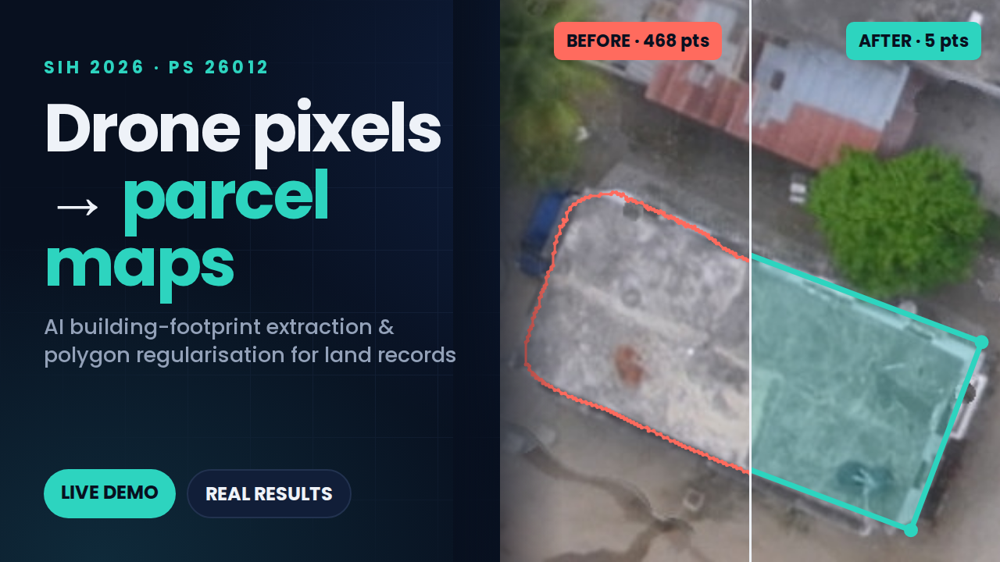
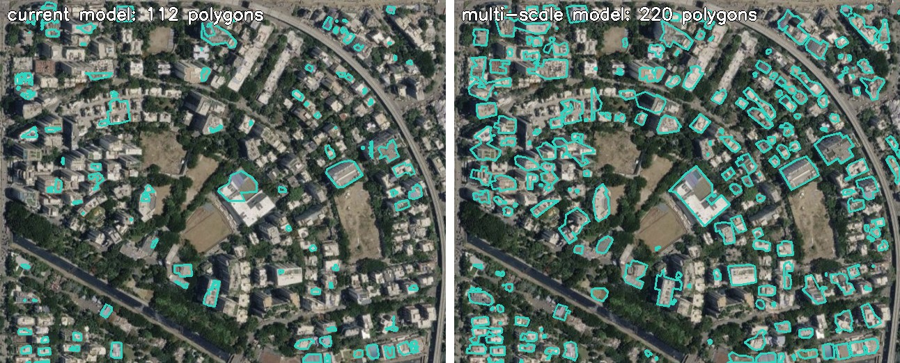

# GeoParcel AI — PS 26012: AI-Based Automated Urban Parcel Mapping

**Smart India Hackathon 2026 · Ministry of Rural Development, Department of Land Resources**

GeoParcel AI turns drone orthomosaics (and, with the multi-scale model, satellite imagery down to ~45 cm/pixel) into **georeferenced building-footprint polygons**: clean, right-angled parcel candidates that can be reviewed in Web-GIS and verified in the field. It targets the same workflow as NAKSHA / SVAMITVA, where drone imagery is captured quickly but every structure still has to be traced by hand.

> Outputs are **preliminary parcel candidates for field verification**. This is decision support, not automated legal adjudication.



---

## Pipeline

```
Drone orthomosaic (GeoTIFF, any size)
        │  resample to the model's working resolution (~7 cm/pixel)
        ▼
Sliding-window inference: 512 px tiles, 64 px overlap, probabilities averaged
        │  U-Net, ResNet-34 encoder (segmentation_models_pytorch), Dice + BCE loss
        ▼
Binary building mask
        │  contour extraction
        ▼
Rectilinear regularisation (src/postprocess/regularize.py)
        │  Douglas–Peucker → dominant orientation (length-weighted, mod 90°)
        │  → snap edges within 38° → least-squares refit of each edge to the contour pixels
        │  → merge collinear segments → rebuild corners from line intersections
        │  → fidelity guard (fall back to the plain outline if IoU vs. mask < 0.88)
        ▼
Parcel candidates exported as GeoJSON (UTM + WGS84), with a ≥ 4 m² area filter
```

## Results

Data: [Open Cities AI Challenge](https://www.drivendata.org/competitions/60/building-segmentation-disaster-resilience/), Dar es Salaam drone imagery (GFDRR Labs, 2020, **ODbL-1.0**). Labels are WGS84 and are reprojected to the raster's UTM CRS before rasterising; without that step, every mask comes out empty.

**Held-out validation tiles** (502 tiles of 512×512 at 7.2 cm/pixel; model trained on 5,008 tiles from scene `0a4c40`, best val IoU 0.6285 at epoch 9 of 10):

| Metric | Raw contours | Regularised |
|---|---|---|
| Pixel IoU (dataset-level) | 0.60 | 0.60 (same mask) |
| Vertices per polygon | 212.8 | **7.9** (~27× simpler) |
| Right-angle corners (90° ± 10°) | 17% | **35%** |
| Polygon IoU vs. ground truth | 0.47 | 0.46 (essentially preserved) |

**Unseen scene `353093`** (never used in training): an 8,192 × 8,192 px window at 4.8 cm/pixel (≈ 396 m × 396 m), tiled, stitched, regularised and exported end to end:
pixel IoU **0.80**, **427** parcel candidates vs. 658 ground-truth footprints → [`results/scene_infer_353093/`](results/scene_infer_353093/)

### Satellite and web-map imagery (multi-scale model)

The first model was trained only at ~7 cm/pixel, and its accuracy collapsed on coarser imagery such as satellite-map screenshots. We fixed this in two steps:

1. **Scale-aware inference in the app:** images are no longer squashed to 512 px. The user picks the image type (drone tile or satellite screenshot), and the app resamples to the model's working scale and runs overlapping tiled inference.
2. **Multi-scale fine-tune:** `src/data/tile_multiscale.py` resamples two more scenes (`b15fce`, `a017f9`) to 7.2 / 12 / 20 / 30 / 45 cm/pixel. `src/train_multiscale.py` fine-tunes from the first checkpoint for 6 epochs with stronger augmentation (JPEG, blur, colour shifts, downscaling). Each epoch keeps 40% of samples at 7.2 cm, so drone accuracy is protected.

Evaluated on the **unseen scene `353093`** resampled to each resolution (`src/eval_gsd.py`, dataset-level pixel IoU; 300 tiles per resolution, 239 at 45 cm):

| Ground resolution | 7.2 cm (drone) | 15 cm | 30 cm | 45 cm (satellite) |
|---|---|---|---|---|
| Drone-only model (`best_model.pt`) | 0.61 | 0.54 | 0.29 | 0.14 |
| **Multi-scale model (`best_model_ms.pt`)** | **0.67** | **0.70** | **0.64** | **0.61** |

On the original 7.2 cm validation set, the multi-scale model scores the same as before (0.643 vs. 0.642 on a 600-tile subset), so it did not forget the drone case. Per-epoch log: [`results/train_ms_log.txt`](results/train_ms_log.txt).

On a satellite screenshot of an Indian city (~35 cm/pixel, no ground truth, so this is qualitative), the multi-scale model finds most mid-rise and large flat-roofed buildings that the first model missed:



High-rise towers seen at an oblique angle are still mostly missed, because the training data has none.

## Repository layout

```
demo_app.py                  Streamlit demo (tiled inference, scale-aware, GT comparison)
src/data/tile_dataset.py     GeoTIFF + GeoJSON → 512 px image/mask tiles (CRS fix)
src/data/tile_multiscale.py  Same, resampled to a set of ground resolutions
src/train.py                 Base training (CUDA / Apple MPS / CPU)
src/train_multiscale.py      Multi-scale fine-tune from an existing checkpoint
src/infer_scene.py           Whole-scene inference → stitched mask → GeoJSON + metrics
src/postprocess/regularize.py  Polygon extraction and rectilinear regularisation
src/eval/                    Metrics (pixel/polygon IoU, vertices, right-angle share), comparison
src/eval_gsd.py              Accuracy per ground resolution
demo_inputs/                 Sample drone tiles + ground-truth masks, and a satellite screenshot crop
results/                     Evaluation outputs and the unseen-scene GeoJSON
```

## Running it

```bash
pip install -r requirements.txt

# Demo: download the weights from the Releases page into checkpoints/
#   https://github.com/OMMEOW/SIH26_PS26012/releases/tag/weights-v1
#   best_model_ms.pt (multi-scale, default) and best_model.pt (drone-only)
streamlit run demo_app.py --server.address localhost
# In the sidebar, pick "Satellite / map screenshot" or "Drone tile" to match your image.

# Data: download the Open Cities tier-1 Dar es Salaam scenes, then
python -m src.data.tile_dataset --scenes 0a4c40
python -m src.train --epochs 10 --batch-size 8 --num-workers 0     # num-workers 0 on macOS

# Whole-scene inference + GeoJSON export
python -m src.infer_scene --tif data/raw/.../353093.tif --labels data/raw/.../353093.geojson \
    --col 12288 --row 36864 --size 8192 --checkpoint checkpoints/best_model.pt --out-dir results/scene_infer_353093

# Multi-scale fine-tune and per-resolution evaluation
python -m src.data.tile_multiscale
python -m src.data.tile_multiscale --scenes 353093 --gsds 7.2 15 30 45 --split-name test
python -m src.train_multiscale
python -m src.eval_gsd --dir data/processed/ms/test --ckpts checkpoints/best_model.pt checkpoints/best_model_ms.pt
```

Model weights (~96 MB each) are published on the [Releases page](https://github.com/OMMEOW/SIH26_PS26012/releases/tag/weights-v1); raw imagery is not stored in the repository.

## Limitations

- Trained on one region (Dar es Salaam). Indian building stock, roofing materials and imagery sources were not in the training data; oblique high-rise towers in particular are often missed.
- Satellite support was measured by resampling drone imagery to coarser resolutions. Real satellite imagery adds sensor and processing differences that this does not fully capture.
- Touching buildings with shared walls can merge into a single candidate.
- Regularisation is deterministic post-processing, not a second learned model.
- Every candidate is meant to be reviewed by a surveyor before it touches a land record.
